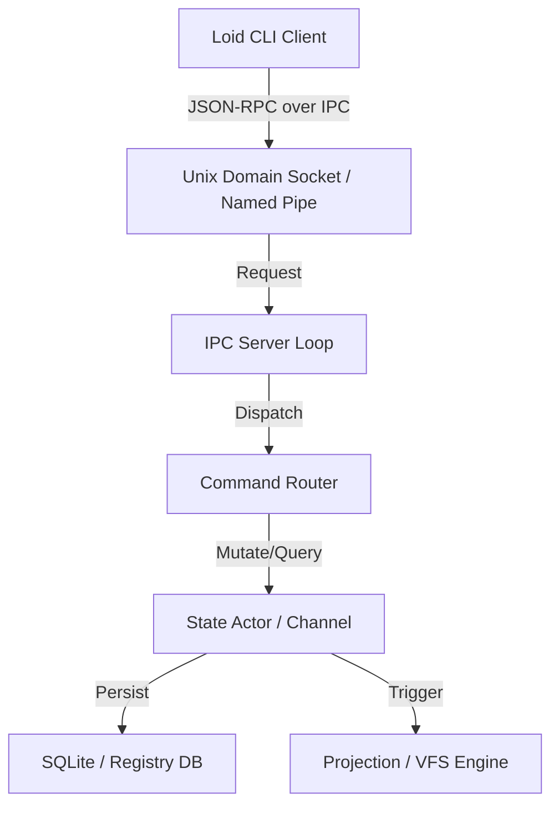

# Code Review & Future-Proof Architecture Proposal: `crates/loid`

This document provides a critical code review of the current `loid` daemon crate and proposes a future-proof architecture to transition it into a production-grade, resilient developer tool daemon.

---

## 1. Critical Code Review & Technical Debt

During our analysis of the `crates/loid` codebase, we identified several severe issues that cause runtime crashes, data loss risks, or security/portability failures.

### 🔴 High Risk: Destructive Side-Effects on User Projects
*   **Location**: [config.rs:L29-35](file:///Users/future/KB/project/app/loi/crates/loid/src/daemon/config.rs#L29-L35)
*   **The Issue**: `sync_project_metadata` reads `Cargo.toml` in the current working directory, mutates the package version field directly to `"0.1.1"`, and writes it back:
    ```rust
    pub fn sync_project_metadata() {
        let mut cargo = read_cargo_toml();
        cargo.package.version = "0.1.1".to_string();
        write_cargo_toml(&cargo);
    }
    ```
*   **Impact**: If a user runs `loid` in a project with a custom version (e.g., `1.2.0`), `loid` will silently overwrite and downgrade their `Cargo.toml` configuration on startup, destroying local project state.

### 🔴 High Risk: Hardcoded Developer Paths
*   **Location**: [projection/document.rs:L49](file:///Users/future/KB/project/app/loi/crates/loid/src/projection/document.rs#L49)
*   **The Issue**: The symbol path resolution logic contains a hardcoded absolute path to a specific local machine folder:
    ```rust
    let abs_path = format!("/Users/me/dev/loid/{}", path);
    ```
*   **Impact**: When running on any other machine or user account, file canonicalization and clickable links will point to non-existent directories, causing silent failures or broken links.

### 🟡 Medium Risk: Synchronous, Single-Threaded TCP Server (Blocking)
*   **Location**: [run.rs:L17-34](file:///Users/future/KB/project/app/loi/crates/loid/src/daemon/run.rs#L17-L34)
*   **The Issue**: The IPC connection loop is synchronous and single-threaded:
    ```rust
    loop {
        let (mut socket, _) = listener.accept().await.unwrap();
        let mut buf = [0; 1024];
        let n = socket.read(&mut buf).await.unwrap();
        ...
    }
    ```
*   **Impact**: If a client establishes a TCP connection but does not send data, the server blocks indefinitely on `socket.read()`. This prevents any other client (e.g., calling `loid status`) from connecting, causing a complete denial of service.

### 🟡 Medium Risk: Fragile Relative Pathing
*   **Location**: [projection/document.rs:L17-23](file:///Users/future/KB/project/app/loi/crates/loid/src/projection/document.rs#L17-L23)
*   **The Issue**: The daemon resolves static data directories relative to the current working directory:
    ```rust
    fn data_dir() -> PathBuf {
        PathBuf::from("src/daemon/data")
    }
    ```
*   **Impact**: If the daemon is run from the workspace root or any directory other than the `crates/loid` directory, it will fail to load `explain.json` or `symbols.json`, causing the daemon to fail silently.

### 🟡 Medium Risk: Widespread panic / unwrap / todo!() usage
*   **Location**: Throughout the codebase (e.g., `stop.rs`, `reload.rs`, `state.rs`, `resolver.rs`).
*   **The Issue**: Methods like `loid stop` and `loid reload` contain `todo!("Todo reload!")` which immediately panics when invoked. File reads/writes use `.unwrap()` directly on I/O results.
*   **Impact**: A simple filesystem lock or permissions error will instantly terminate the entire daemon process.

---

## 2. Proposed Future-Proof Architecture

To transition `loid` into a resilient, production-grade daemon, we suggest implementing the following architectural modules:



### 1. Robust IPC: Unix Domain Sockets & Named Pipes
Instead of hardcoding a TCP port (`127.0.0.1:7788`) which is vulnerable to port conflicts and port scanning, use operating system native IPC:
*   **Unix-like systems (Linux, macOS)**: Use Unix Domain Sockets (UDS) bound to `~/.loid/socket`. UDS supports file-system level access permissions, keeping the socket secure.
*   **Windows**: Use Named Pipes (e.g., `\\.\pipe\loid`).
*   **Implementation**: Use the `interprocess` or `parity-tokio-ipc` crate to abstract UDS and Named Pipes under a single interface.

### 2. Standardized Communication Protocol (JSON-RPC)
Instead of parsing raw string comparisons like `cmd.trim() == "status"`, implement a structured RPC system:
*   Use a JSON-RPC 2.0 framework over the IPC connection.
*   Define clear API endpoints:
    *   `status()`: Returns health and state statistics.
    *   `stop()`: Safely closes resources and shuts down the daemon.
    *   `reload()`: Flushes caches and reloads workspace configs.
    *   `view_list()`: Lists all active and inactive projection views.
    *   `change_view(name)`: Switches the active projection.

### 3. Non-Blocking Event Loop (Tokio Task Spawning)
Resolve the blocking server issue by spawning a green thread (Tokio task) for every incoming connection:
```rust
async fn serve(listener: IpcListener) {
    loop {
        let socket = listener.accept().await.unwrap();
        tokio::spawn(async move {
            handle_client(socket).await;
        });
    }
}
```
If a client hangs, it will only block its spawned task, keeping the main daemon server responsive.

### 4. Actor-Based State & Projection Management
Keep the daemon state and compilation/projection engines synchronized without data races:
*   Run the active `CompileState` and `ProjectionEngine` inside separate long-running Tokio tasks (Actors).
*   Communicate with the state manager via message-passing channels (`tokio::sync::mpsc` and `tokio::sync::oneshot` for responses).
*   This removes complex thread-locking and ensures file updates, cache invalidations, and view switches happen sequentially and safely.

### 5. Safe Service Management (Daemonization)
Add true background execution support:
*   On Unix, use the `daemonize` crate to detach the process from the terminal, redirect `stdout`/`stderr` to `~/.loid/logs/loid.log`, and manage file descriptors.
*   Manage a PID file (`~/.loid/daemon.pid`) using a lockfile wrapper (e.g., `fs2` crate) to guarantee that only one instance of the daemon runs at any given time.
